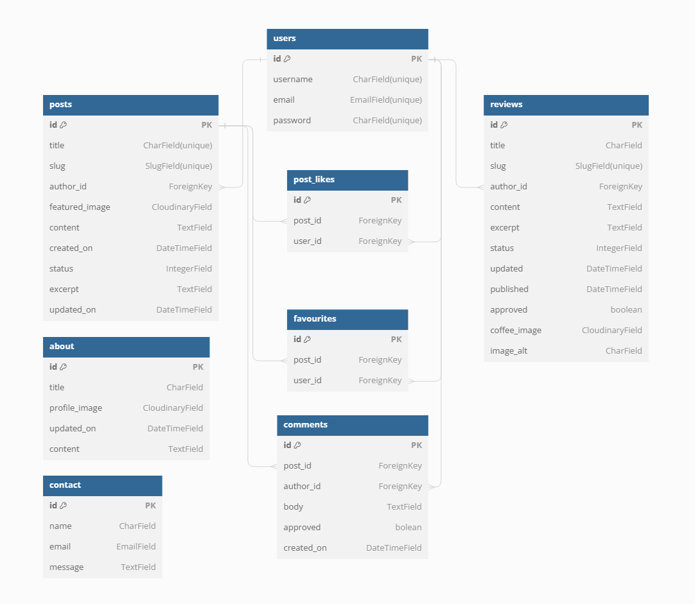

  

<h1 align="center">Cups Of Joy</h1>

<h2>Welcome</h2>

Link to live website: [CLICK HERE!](https://cupsofjoy-c2c917eb3f59.herokuapp.com/)

# Introduction

## Cups of Joy

Welcome to [**Cups of Joy**](documentation/amireponsive/cupsofjoy.png), a vibrant online platform dedicated to celebrating the art of coffee and fostering a sense of community. Our mission is to create a warm and inviting space where coffee enthusiasts can explore the rich world of artisanal brews, share their passion, and connect with like-minded individuals.

At Cups of Joy, we believe that every cup tells a story – one of craftsmanship, culture, and the pursuit of pure indulgence. Through our engaging content, we aim to inspire and educate, unveiling the secrets behind exceptional coffee experiences. Join us on this flavorful journey as we savor the finest beans, unravel brewing techniques, and uncover the tales behind each sip.

### Get Involved

Join **Cups of Joy** today and immerse yourself in a world where coffee is more than just a beverage – it's a passion, a culture, and a way of life. Our vibrant community welcomes coffee enthusiasts of all levels, from seasoned aficionados to curious explorers. Whether you're here to expand your knowledge, share your love for the perfect brew, or simply indulge in the rich aromas and flavors, our platform is your gateway to a vast and captivating landscape of coffee experiences. Let's embark on this flavorful journey together, savoring each sip, exchanging stories, and uncovering the secrets that make every cup a true masterpiece.

# Table of Contents
- [Introduction](#introduction)
  - [Cups Of Joy](#cups-of-joy)
    - [Our Website Features](#our-website-features)
    - [Get Involved](#get-involved)
- [Table of Contents](#table-of-contents)
- [Overview](#overview)
- [UX - User Experience](#ux---user-experience)
- [Design](#design)
  - [Colour Scheme](#colour-scheme)
  - [Fonts](#fonts)
    - [Google Fonts](#google-fonts)
      - [Roboto](#roboto)
      - [Lato](#lato)
- [Project Planning](#project-planning)
  - [Strategy Plane](#strategy-plane)
  - [Agile Methodologies - Project Management:](#agile-methodologies---project-management)
    - [Story Points Allocation](#story-points-allocation)
    - [Sprint Planning Example](#sprint-planning-example)
    - [MoSCoW Prioritization:](#moscow-prioritization)
    - [User Stories, Milestones and Epics](#user-stories-milestones-and-epics)
      - [Users Stories](#users-stories)
      - [Milestones](#milestones)
      - [Epics](#epics)
        - [EPIC 1: Website Content Creation and Publishing](#epic-1-website-content-creation-and-publishing)
        - [EPIC 2: Website Usability and Navigation](#epic-2-website-usability-and-navigation)
        - [EPIC 3: Content Discovery and Exploration](#epic-3-content-discovery-and-exploration)
        - [EPIC 4: User Account](#epic-4-user-account)
  - [Scope Plane](#scope-plane)
  - [Structural Plane](#structural-plane)
  - [Skeleton \& Surface Planes](#skeleton--surface-planes)
    - [Wireframes](#wireframes)
      - [Home Page Wireframes](#home-page-wireframes)
      - [Articles Page Wireframes](#articles-page-wireframes)
      - [Reviews Page Wireframes](#reviews-page-wireframes)
      - [About \& Contact Page Wireframes](#about--contact-page-wireframes)
      - [Single Article Page Wireframes](#single-article-page-wireframes)
      - [Register Page Wireframes](#register-page-wireframes)
      - [Login Page Wireframes](#login-page-wireframes)
      - [Logout Page Wireframes](#logout-page-wireframes)
      - [My Favourites Page Wireframes](#my-reviews-page-wireframes)
      - [My Reviews Page Wireframes](#my-likes-page-wireframes)
      - [My Comments Page Wireframes](#my-comments-page-wireframes)
      - [Single Review Page Wireframes](#single-review-page-wireframes)
      - [Add \& Edit Review Page Wireframes](#add--edit-review-page-wireframes)
    - [Database Schema - Entity Relationship Diagram](#database-schema---entity-relationship-diagram)
      - [Database Schema](#database-schema)
      - [Entity Relationship Diagram (ERD)](#entity-relationship-diagram-erd)
      - [Tables Overview](#tables-overview)
      - [Relationships](#relationships)
    - [Security](#security)
      - [Data Encryption](#data-encryption)
      - [CSRF Tokens](#csrf-tokens)
      - [AllAuth](#allauth)
- [Features](#features)
  - [Existing Features](#existing-features)
    - [Features Functionality](#features-functionality)
    - [CRUD Functionality](#crud-functionality)
    - [All Existing Features with Screenshots](#all-existing-features-with-screenshots)
      - [Home Page](#home-page)
      - [User Registration, Login, and Logout](#user-registration-login-and-logout)
      - [User Profile](#user-profile)
      - [Add Post](#add-post)
      - [Search Functionality](#search-functionality)
      - [Post Details](#post-details)
      - [Comments and Interactions](#comments-and-interactions)
      - [Responsive Navigation Bar](#responsive-navigation-bar)
      - [Categories](#categories)
      - [My Bookmarks](#my-bookmarks)
      - [My Likes](#my-likes)
      - [My Comments](#my-comments)
      - [My Posts](#my-posts)
      - [Pagination](#pagination)
      - [Footer](#footer)
      - [Admin Panel](#admin-panel)
      - [Error Handling](#error-handling)
  - [Future Features](#future-features)
- [Technology Used](#technology-used)
  - [Frontend](#frontend)
  - [Backend](#backend)
  - [Deployment and Version Control](#deployment-and-version-control)
  - [Development Tools](#development-tools)
  - [Libraries and Frameworks](#libraries-and-frameworks)
  - [Validation Tools](#validation-tools)
  - [Others](#others)
- [Testing](#testing)
- [Deployment](#deployment)
  - [GitHub](#github)
  - [Gitpod](#gitpod)
  - [Heroku](#heroku)
  - [ElephantSQL](#elephantsql)
  - [Cloudinary](#cloudinary)
- [Cloning and Forking](#cloning-and-forking)
  - [Cloning the Repository](#cloning-the-repository)
  - [Forking the Repository](#forking-the-repository)
- [Credits](#credits)
  - [Code](#code)
  - [Media](#media)
  - [Additional reading/tutorials/books/blogs](#additional-readingtutorialsbooksblogs)
  - [Acknowledgements](#acknowledgements)

# Overview

Cups of Joy is a vibrant online platform celebrating the art of coffee and fostering a sense of community. It serves as a communal hub for:

- Joining a passionate community of coffee enthusiasts and professionals.
- Creating personalized profiles to share coffee experiences and insights.
- Contributing and interacting with engaging content on coffee culture.
- Discovering the latest trends, techniques, and best practices in the world of coffee.
- Facilitating discussions and exchanges within a supportive coffee-loving community.

Accessible across various devices and browsers, Cups of Joy aims to demystify the complexities of coffee, making the art of brewing and appreciation accessible to a diverse audience. Whether you're a seasoned barista, a coffee connoisseur, or a curious newcomer, the platform offers tailored resources to support your journey into the world of coffee.

Cups of Joy envisions fostering a collaborative ecosystem where members can learn, share, and grow together in their love for coffee. By engaging with the platform, users can stay ahead of coffee trends, enhance their brewing skills, and connect with like-minded individuals. As the platform evolves, future enhancements will include advanced interactive features, further enriching the user experience and community engagement around the shared passion for coffee.

# UX - User Experience

The UX design of Cups Of Joy revolves around creating an immersive and engaging experience for coffee enthusiasts. With a focus on community, personalization, and seamless navigation, we aim to provide a delightful journey through the world of coffee. Here's a breakdown of our user experience:

- **Intuitive Navigation:** Our user-friendly interface ensures effortless exploration of articles, reviews, and community contributions, making it easy for users to find their desired content.
- **Responsive Design:** Whether accessing Cups Of Joy from a desktop, tablet, or mobile device, our responsive layout adapts seamlessly, ensuring a consistent and enjoyable experience across all platforms.
- **Engaging Content:** Our articles, reviews, and community posts are crafted to captivate and inform, offering a wealth of knowledge and insights into the art of coffee appreciation.
- **Personalization:** Users can create personalized accounts, allowing them to save their favorite articles, follow fellow coffee enthusiasts, and curate their own collection of coffee experiences.

- **Interactive Community:** We foster a vibrant community where users can share their passion, exchange ideas, and engage in discussions through comments, likes, and personal reviews of coffee shops and flavors.

- **Seamless Contribution:** Our platform empowers users to contribute their own content, whether it's writing reviews, sharing personal coffee stories, or offering tips and recommendations to fellow enthusiasts.

Overall, the UX design of Cups Of Joy aims to create an immersive and inclusive environment where coffee lovers can explore, learn, and connect, all while savoring the rich flavors and experiences that the world of coffee has to offer.

# Design

## Colour Scheme

The color scheme for Cups Of Joy is carefully crafted to evoke a warm, inviting, and coffee-inspired atmosphere. Here's a detailed breakdown:

[Coolors](https://color.romanuke.com/tsvetovaya-palitra-1160/) - Colour Scheme for Cups Of Joy website

- **#4a5060 (Dark Grayish Blue):** This deep, rich shade is used as the primary background color for the navigation menu, creating a cozy and grounding foundation for the website.

- **#70AFE2 (Bright Sky Blue):** Reminiscent of a clear morning sky, this vibrant hue is employed for accents, buttons, and interactive elements, adding a refreshing and energizing touch to the design.

- **#926e5a (Warm Brown):** Inspired by the rich tones of freshly brewed coffee, this earthy shade is utilized for accents and highlights, evoking a sense of comfort and familiarity.

- **#929fb0 (Soft Gray):** This muted gray tone serves as a complementary color, providing a subtle backdrop for content and allowing the other colors to shine.

- **#FFFFFF (White):** Used for backgrounds, text, and other elements, white creates a clean and crisp canvas, ensuring excellent readability and contrast.

- **#000000 (Black):** This bold and classic color is used for text, borders, and other accents, providing a strong contrast and adding depth to the overall design.

The color palette is carefully curated to create a harmonious and visually appealing experience, capturing the essence of coffee culture while maintaining a modern and inviting aesthetic. The deep blues and grays establish a cozy ambiance, while the warm browns and vibrant accents evoke the rich flavors and aromas of coffee.

This color scheme not only enhances the visual appeal of Cups Of Joy but also supports usability and accessibility, guiding users through the platform and creating a welcoming environment for coffee enthusiasts to explore, connect, and indulge in their passion.

## Fonts

The font choices for **Cups Of Joy** are carefully curated to create a warm, inviting, and coffee-inspired atmosphere. By leveraging the power of typography, we aim to enhance the user experience and immerse our visitors in the rich world of coffee culture.

### Google Fonts

**Cups Of Joy** utilizes fonts from  [Google Fonts](https://fonts.google.com/), a library of open-source font families, ensuring easy integration and accessibility across various devices and platforms.

#### Roboto
- **Usage:** Body text, descriptions, and content.

- **Characteristics:** Clean, modern, and highly legible, with a friendly and approachable design.

- **Reason for Selection:** Roboto's simple yet elegant style perfectly complements the cozy and welcoming vibe of Cups Of Joy. Its readability ensures that our content is easily consumable, allowing coffee enthusiasts to immerse themselves in the stories and experiences we share.

[Roboto on Google Fonts](https://fonts.google.com/specimen/Roboto)

#### Lato
- **Usage**: Headings, titles, and emphasis
- **Characteristics**: A harmonious blend of soft curves and strong lines, striking a balance between warmth and sophistication.
- **Reason for Selection**: Lato's unique character captures the essence of coffee culture – a fusion of comfort and craftsmanship. Its distinctive yet approachable style draws attention to important elements, guiding users through the platform while evoking a sense of artistry and passion.

[Lato on Google Fonts](https://fonts.google.com/specimen/Lato)

By combining the friendly readability of Roboto with the warm sophistication of Lato, Cups Of Joy creates a typographic experience that resonates with coffee lovers. Each letter, word, and line invites users to explore, savor, and connect with the rich tapestry of flavors, aromas, and stories that make the coffee world so captivating.

# Project Planning

## Strategy Plane

**Project Overview:**  
Cups Of Joy is an immersive online platform dedicated to celebrating the rich culture of coffee. It serves as a vibrant community hub where coffee enthusiasts can explore captivating articles, engage in discussions, contribute reviews, and share their personal coffee journeys. With personalized accounts, users can curate their favorite content, follow fellow connoisseurs, and actively participate by writing reviews, sharing stories, and offering recommendations. Whether you're a seasoned barista or a curious newcomer, Cups Of Joy invites you to indulge in the magic of coffee, connect with like-minded individuals, and embark on a flavorful adventure through the vast landscape of artisanal brews.

**Site Goals:**
- Create an engaging platform where coffee lovers can explore and learn about the world of coffee through informative articles and reviews.

- Build a vibrant community that encourages members to share their passion, experiences, and knowledge about coffee.

- Offer a user-friendly interface that is accessible and easy to navigate, ensuring a seamless experience for both desktop and mobile users.

- Enable personalized features that allow members to create accounts, save their favorite content, follow other coffee enthusiasts, and contribute their own reviews and stories.

- Continuously enhance the platform based on user feedback and evolving trends in the coffee industry, ensuring a dynamic and up-to-date experience.

## Agile Methodologies - Project Management:  
Cups Of Joy embraces Agile methodologies, enabling iterative development and continuous enhancement. Through GitHub Projects, tasks are efficiently managed, and progress is tracked using a Kanban-style board, ensuring a seamless workflow and timely delivery of new features.ard.

### Story Points Allocation

**Story Points Distribution**
Story points were meticulously assigned to each user story, quantifying the effort and complexity involved in developing features for Cups Of Joy. This approach facilitated effective workload estimation and task prioritization, ensuring a smooth development process.

**Allocation Guidelines:**
- **Must-have Stories**: Core functionalities like creating user accounts, writing reviews, and sharing content were given the highest priority, ensuring the platform's primary purpose was met.
- **Should-have Stories**: Features that improve the overall user experience, such as personalization options and community engagement tools, were considered important but not critical. These were prioritized after the essential features were implemented.
- **Could-have Stories**: Additional features like integration with external coffee communities or advanced analytics were considered desirable but not essential for the initial launch of Cups Of Joy.

### Sprint Planning Example
Here is an example of how story points are managed and allocated across different categories in sprints:

- **Total Story Points for the Sprint**: 100
- **Must-have Points**: 40 (40% of the total)
- **Should-have Points**: 50 (50% of the total)
- **Could-have Points**: 10 (10% of the total)

**Example Milestones:**
- **Milestone 1: Core Functionality**
  - Total Story Points: 60
  - Breakdown:
    - Must-have: 36 points
    - Should-have: 24 points
- **Milestone 2: Enhanced User Experience**
  - Total Story Points: 80
  - Breakdown:
    - Must-have: 32 points
    - Should-have: 48 points

### MoSCoW Prioritization:

Cups Of Joy follows the MoSCoW prioritization method to ensure a structured and efficient development approach:

- **Must Haves**: Fundamental features enabling users to read articles, create accounts, save favorites, and contribute reviews and comments about coffee shops and flavors.
- **Should Haves**: Enhancing the platform with personalization options, advanced search capabilities, and community engagement tools like following fellow enthusiasts.
- **Could Haves**: Additional functionalities such as integration with external coffee communities, gamification elements to encourage participation, and advanced analytics.
- **Won't Haves**: Features deemed non-essential for the initial launch, like a dedicated e-commerce platform or third-party advertising integrations.

### User Stories, Milestones and Epics

#### Users Stories

**User stories** are a brief statement of intent that captures what a user does or needs to do as part of their job function. They are written in non-technical language and focus on the value or outcome that the user

| Epic                                               | Title                                    | User Story                                                                                                                                                                        |  MoSCoW Priority |  Milestone                   |
|----------------------------------------------------|------------------------------------------|-----------------------------------------------------------------------------------------------------------------------------------------------------------------------------------|------------------|------------------------------|
| EPIC 1 : Website Content   Creation and Publishing | Manage and Publish Articles              | As an admin, I want to manage   and publish articles, so that I can control the website's content.                                                                                | **Must Have**    | Core Features Development    |
| EPIC 1 : Website Content   Creation and Publishing | Moderate User-Submitted Reviews          | As an admin, I want to moderate user-submitted reviews, so   that I can maintain the quality and appropriateness of the content.                                                  | **Must Have**    | Core Features Development    |
| EPIC 1 : Website Content   Creation and Publishing | Like, Save Favorite Articles and Reviews | As a registered user, I want to   comment, like and save articles as favorites, so that I can easily access   them later.                                                         | **Must Have**    | Core Features Development    |
| EPIC 1 : Website Content   Creation and Publishing | Write Article Comments                   | As a registered user, I want to add and manage comments on   articles, so that I can actively participate in discussions and share my   thoughts.                                 | **Must Have**    | User Experience Enhancements |
| EPIC 1 : Website Content   Creation and Publishing | Moderate Article Comments                | As an admin, I want to manage and moderate comments on   articles, so that I can maintain the quality and appropriateness of the   content.                                       | **Must Have**    | Core Features Development    |
| EPIC 1 : Website Content   Creation and Publishing | Write Coffee Shop Reviews                | As a registered user, I want to write, edit, and delete my own   coffee shop reviews, so that I can contribute to the community and share my   experiences.                       | **Should Have**  | User Experience Enhancements |
| EPIC 1 : Website Content   Creation and Publishing | Moderate Coffee Shop Reviews             | As an admin, I want to manage and moderate coffee shop   reviews, so that I can maintain the quality and appropriateness of the   content.                                        | **Must Have**    | User Experience Enhancements |
| EPIC 2: Website Usability and   Navigation         | Intuitive Website Navigation             | As a visitor, I want to easily navigate through the website's   content and find relevant information, so that I can explore coffee-related   topics efficiently.                 | **Must Have**    | Core Features Development    |
| EPIC 2: Website Usability and   Navigation         | Account Features Navigation              | As a registered user, I want to   personalize my website experience and access my account-related features   easily, so that I can efficiently manage my content and preferences. | **Must Have**    | Content Administration       |
| EPIC 2: Website Usability and   Navigation         | Administrative Dashboard Access          | As an admin, I want to access and navigate the website's   administrative features efficiently, so that I can manage content and user   accounts effectively.                     | **Must Have**    | Content Administration       |
| EPIC 2: Website Usability and   Navigation         | Search Function                          | As   a visitor, I want to easily search through the website's content by keywords,   tags, or categories.                                                                         | **Must Have**    | User Experience Enhancements |
| EPIC 2: Website Usability and   Navigation         | Filter Coffee Shop Reviews               | As a visitor, I want to easily filter and discover reviews and   comments about different coffee shops, so that I can make informed decisions   about where to visit.             | **Must Have**    | User Experience Enhancements |
| EPIC 3: Content Discovery and   Exploration        | Browse and Read Articles                 | As   a visitor, I want to browse and read articles on the website, so that I can   learn about coffee culture and explore different topics.                                       | **Must Have**    | User Experience Enhancements |
| EPIC 3: Content Discovery and   Exploration        | View Coffee Shop Reviews                 | As   a visitor, I want to view coffee shop reviews, so that I can make informed   decisions about where to visit.                                                                 | **Must Have**    | User Experience Enhancements |
| EPIC 3: Content Discovery and   Exploration        | Favorite and Manage Articles             | As a registered user, I want to favorite articles and manage   my favorite list, so that I can easily access and revisit content that   interests me.                             | **Should Have**  | User Experience Enhancements |
| EPIC 3: Content Discovery and   Exploration        | Read Article Comments                    | As a visitor, I want to read comments on articles, so that I   can gain additional insights and perspectives from the community.                                                  | **Must Have**    | User Experience Enhancements |
| EPIC 3: Content Discovery and   Exploration        | View Article Likes                       | As a visitor, I want to see the number of likes on articles,   so that I can gauge the popularity and engagement of the content.                                                  | **Should Have**  | User Experience Enhancements |
| EPIC 3: Content Discovery and   Exploration        | Like and Unlike Articles                 | As a registered user, I want to like or unlike articles, so   that I can express my interest and engagement with the content.                                                     | **Should Have**  | User Experience Enhancements |
| EPIC 3: Content Discovery and   Exploration        | Read Coffee Shop Reviews                 | As a visitor, I want to read reviews about coffee shops, so   that I can make informed decisions about where to visit.                                                            | **Must Have**    | User Experience Enhancements |
| EPIC 4: User Account                               | Create and Manage User Profile           | As a registered user, I want to create and manage my account   profile, so that I can personalize my experience and save preferences.                                             | **Must Have**    | Core Features Development    |
| EPIC 4: User Account                               | User Registration                        | As   a visitor, I want to have the option to sign up for an account, so that I can   access additional features and personalized content.                                         | **Must Have**    | Community   Engagement       |
| EPIC 4: User Account                               | User Management                          | As an admin, I want to manage registered users from the admin   back office, so that I can oversee and maintain user accounts effectively.                                        | **Must Have**    | Core Features Development    |

[Cups Of Joy GitHub Link](https://github.com/AmirShkolnik/Cups-of-Joy)

[Cups Of Joy Kanban Board Link](https://github.com/users/AmirShkolnik/projects/8)

[Cups Of Joy User Stories Link](https://github.com/AmirShkolnik/Cups-of-Joy/issues)

[Cups Of Joy Milestones Link](https://github.com/AmirShkolnik/Cups-of-Joy/milestones)

#### Milestones

**A milestone**, is a major checkpoint or goal in a project's timeline that signifies the completion of a key phase or the achievement of a significant objective.

#### Epics

**An epic** is a large feature or goal that is divided into smaller tasks or user stories to be completed over multiple sprints.

##### EPIC 1: Website Content Creation and Publishing
- **Goal:** This epic focuses on creating engaging and informative website content to attract, educate, and retain visitors on the Cups of Joy platform.
- **Associated User Stories:**
  - Manage and Publish Articles
  - Moderate User-Submitted Reviews
  - Like, Save Favorite Articles and Reviews
  - Write Article Comments
  - Moderate Article Comments
  - Write Coffee Shop Reviews
  - Moderate Coffee Shop Reviews
  

##### EPIC 2: Website Usability and Navigation
- **Goal:** The Website Usability and Navigation epic aims to deliver an intuitive and enjoyable experience through optimized design, layout, and navigation elements for all user roles.
- **Associated User Stories:**
  - Intuitive Website Navigation
  - Account Features Navigation
  - Administrative Dashboard Access
  - Search Function
  - Filter Coffee Shop Reviews
  

##### EPIC 3: Content Discovery and Exploration
- **Goal:** This epic enables easy content discovery and exploration for all users, including browsing articles, reviews, likes, and comments, through user-friendly features that surface relevant and engaging information.
- **Associated User Stories:**
  - Browse and Read Articles
  - View Coffee Shop Reviews
  - Favorite and Manage Articles
  - Read Article Comments
  - View Article Likes
  - Like and Unlike Articles
  - Read Coffee Shop Reviews
  

##### EPIC 4: User Account
- **Goal:** The User Account epic covers account creation, management, and personalization features.
- **Associated User Stories:**
  - Create and Manage User Profile
  - User Registration
  - User Management
  
Every epic represents a major feature area, guiding development from initial setup to a full-fledged, engaging community platform

## Scope Plane

**Purpose:**

The purpose of the "Cups of Joy" website is to provide a comprehensive platform for coffee enthusiasts and casual drinkers alike. For random visitors, it serves as a valuable resource for exploring the world of coffee, discovering new cafes, and gaining insights into the coffee culture. For registered users, the website offers a personalized experience, enabling them to contribute to the community, share their experiences, and connect with like-minded individuals.

**Goals:**

- Create a vibrant online community for coffee lovers to connect, share, and learn.
- Establish a trusted source of information and reviews for coffee shops and cafes.
- Foster a collaborative environment where users can contribute content and engage in discussions.

**Target Audience:**

- Coffee enthusiasts who are passionate about exploring different brews and roasts.
- Casual coffee drinkers seeking recommendations and insights into local cafes.
- Travelers and tourists looking for highly-rated coffee shops in various locations.
- Coffee shop owners and baristas interested in connecting with their customer base.

**User Needs:**
- Access to comprehensive and up-to-date information about coffee shops, including menus, pricing, and ambiance.
- Ability to read and contribute reviews, ratings, and comments about coffee shops and their offerings.
- Personalized features for registered users, such as saving favorite cafes, creating lists, and managing their contributions.
- Engaging content and resources related to coffee culture, brewing methods, and industry trends.

**Features:**

- Comprehensive directory of coffee shops with detailed information and user-generated reviews.
- User registration and profile management for personalized experiences.
- Ability for registered users to contribute reviews, ratings, and comments on coffee shops.
- Content management system for admins to publish articles, guides, and resources related to coffee.
- Interactive features like forums, events, and meetups for the coffee community.
Search and filtering capabilities to easily find relevant coffee shops and content.

## Structural Plane

**Information Architecture:**

**Home Page**
- Welcome message
- Quick links to articles, reviews about us and Registration/sign-in pages

**Articles Page**
- List of articles
- Links to individual article pages
- Display number of likes

**Single Article Page**
- Article title, author, date
- Article content (text, images, etc.)
- Comments section
- Like and favourites for registered users

**Single Review Page**
- Review title, author, date
- Review content (text, images etc.)

**Reviews List Page**
- List of all reviews
- Links to individual review pages

**About & Contact Pages**
- Information about the website and its purpose
- Contact form

**Registration and Sign-In Page**
- User registration form
- User sign-in form

**User Profile**
- User information (name, avatar, bio)
- Saved articles and reviews
- User comments and contributions
- Personalization settings

**Navigation**
- Primary Navigation: Links to category pages, about page, contact page
- Registered Users: Links to user profile, favorites, reviews, comments
- Secondary Navigation: Links to registration/sign-in, user profile
- Footer Navigation: Links to home page, reviews, about us, social media

**Interaction Design**
- Responsive design for optimal viewing across devices
- Interactive elements (buttons, links, forms) with visual cues (icons, color changes)
- Intuitive navigation and user flows

## Skeleton & Surface Planes

### Wireframes

**Desktop, Mobile and Tablet**

I've used [Balsamiq](https://balsamiq.com/wireframes) to design my site wireframes.

#### Home Page Wireframes

Click to View Home Page wireframes

**Desktop, Mobile and Tablet**

#### Articles Page Wireframes

Click to View Articles Page wireframes

**Desktop, Mobile and Tablet**

#### Reviews Page Wireframes

Click to View Reviews Page wireframes

**Desktop, Mobile and Tablet**

#### About & Contact Page Wireframes

Click to View About & Contact Page wireframes

**Desktop, Mobile and Tablet**

#### Single Article Page Wireframes

Click to View Single Article Page wireframes

**Desktop, Mobile and Tablet**

#### Register Page Wireframes

Click to View Register Page wireframes

**Desktop, Mobile and Tablet**

#### Login Page Wireframes

Click to View Login Page wireframes

**Desktop, Mobile and Tablet**

#### Logout Page Wireframes

Click to View Logout Page wireframes

**Desktop, Mobile and Tablet**

#### My Favourites Page Wireframes

Click to View My Favourites Page wireframes

**Desktop, Mobile and Tablet**

#### My Reviews Page Wireframes

Click to View My Reviews Page wireframes

**Desktop, Mobile and Tablet**

#### My Comments Page Wireframes

Click to View My Comments Page wireframes

**Desktop, Mobile and Tablet**

#### Single Review Page Wireframes

Click to View Single Review Page wireframes

**Desktop, Mobile and Tablet**

#### Add & Edit Review Page Wireframes

Click to View Add and Edit Review Page wireframes

**Desktop, Mobile and Tablet**

### Database Schema - Entity Relationship Diagram

I've used [dbdiagram](https://dbdiagram.io/home) to design my site's ERD.

#### Database Schema

#### Entity Relationship Diagram (ERD)

The Entity Relationship Diagram (ERD) is a visual representation of the database structure for the Cups Of Joy project. It illustrates the relationships between different entities (tables) and their attributes (columns). The ERD helps in understanding the data organization and facilitates efficient database design.

#### Tables Overview

In the Cups Of Joy project, the ERD consists of the following entities:

### Entities

1. **User**: This entity stores user information such as username, email, password, and other relevant details.

2. **Post**: This entity represents the posts or content created by users. It may include attributes like post title, content, date, and author (linked to the User entity).

3. **Like**: This entity tracks the likes given by users on posts. It may have attributes like the user who liked the post and the post that was liked.

4. **Favorite**: This entity stores the posts marked as favorites by users. It may have attributes like the user who favorited the post and the post that was favorited.

5. **Review**: This entity represents the reviews or ratings given by users for posts. It may include attributes like the review text, rating score, and the user who wrote the review.

6. **Comment**: This entity stores the comments made by users on posts. It may have attributes like the comment text, date, and the user who posted the comment.

7. **Contact**: This entity stores contact information submitted by users through a contact form. It may include attributes like name, email, message, and date.

#### Relationships

The relationships between these entities are as follows:

- **User** has a one-to-many relationship with **Post**, **Like**, **Favorite**, **Review**, and **Comment**, meaning a user can have multiple posts, likes, favorites, reviews, and comments.
- **Post** has a one-to-many relationship with **Like**, **Favorite**, **Review**, and **Comment**, meaning a post can have multiple likes, favorites, reviews, and comments.
- **Like** has a many-to-one relationship with **User** and **Post**, indicating that a like is associated with one user and one post.
- **Favorite** has a many-to-one relationship with **User** and **Post**, indicating that a favorite is associated with one user and one post.
- **Review** has a many-to-one relationship with **User** and **Post**, indicating that a review is associated with one user and one post.
- **Comment** has a many-to-one relationship with **User** and **Post**, indicating that a comment is associated with one user and one post.

The ERD provides a clear understanding of the data structure and relationships within the Cups Of Joy project, facilitating efficient database design and development.

### Security

Security is a paramount concern for a platform like Cups Of Joy, which handles user-generated content and personal data.

#### Data Encryption

- All sensitive information, including user passwords and personal details, is encrypted using robust encryption methods to safeguard against unauthorized access and potential breaches.

#### CSRF Tokens

- CSRF (Cross-Site Request Forgery) tokens are included in every form to authenticate requests with the server during form submission. The absence of these tokens could leave the site vulnerable to attackers attempting to steal user data.

#### AllAuth 

- Django AllAuth, an installable framework, handles user registration and authentication processes. Authentication is crucial for determining registered and unregistered users, controlling access to specific content on Cups Of Joy.

# Features

## Existing Features

### Features Functionality

Software Stacks is a dynamic web application that allows users to engage with content across various technology domains. Below is a table highlighting its features, detailing the level of access for unregistered and registered users, and the CRUD (Create, Read, Update, Delete) functionalities available:

| Feature           | User | Registered and Logged-in User           | CRUD Functionality        |
|-------------------|------|---------------------------|---------------------------|
| Navigation Bar   | |  |  |
| User register, log in, and log out  | create |  | Read/Create/Update/Delete |
| Single Article    | View | Read/Create/Update/Delete | Read/Create/Update/Delete |
| Reviews           | View | View                      | View                      |
| Single Review     | View | Read/Create/Update/Delete | Read/Create/Update/Delete |
| Like              | View | Create, Delete            | Create, Delete            |
| Comments          | View | Read/Create/Update/Delete | Read/Create/Update/Delete |
| View User Profile | Read | Read, Update              | Read, Update              |
| Favorite          | -    | Read/Create/Delete        | Read/Create/Delete        |
| Footer   | |  |  |
| Django Messages   | |  |  |

---

### CRUD Functionality

The table below describes the CRUD operations that can be performed on Cups Of Joy main features by a registered, logged-in user.

| Feature               | Create                    | Read                        | Update               | Delete                 |
|-----------------------|---------------------------|-----------------------------|----------------------|------------------------|
| **User Account**     | Sign up for a new account | View own content | Edit own content     | Deactivate/Delete account |
| **Reviews**             | Publish new reviews        | Browse and read all articles and reviews  | Edit own reviews       | Remove own reviews       |
| **Comments**          | Comment on articles          | View comments              | Edit own comments    | Delete own comments    |
| **Likes**             | Like articles   | See likes on articles | -                    | Unlike articles  |
| **Favourites**         | Add a favourite            | View bookmarked posts      | -                    | Remove bookmarks       |
|  **Articles**     | -                         | -        | -                    | -                      |

Certainly, here's a detailed existing features section for Software Stacks using the provided template:

### All Existing Features with Screenshots

#### Home Page

  - The initial point of contact with Software Stacks, where users can understand the platform's offerings. Featured articles, latest stacks, and prominent categories are displayed here.

  

#### User Registration, Login, and Logout

  - New users can sign up by providing their username, email, and password. Existing users can log in using their credentials to access personalized features.

  **Registration/SignUp**
      

  **Login/SignIn**  
    

  **Logout/Signout**
    

#### User Profile

  - Upon logging in, users can view and edit their profiles, see their published stacks, and manage bookmarks and likes.

  
  

#### Add Post

  - Registered users can contribute by creating their own stacks. They can include a title, content, images, and select categories for their Post.

  

#### Search Functionality

  - Both registered and unregistered users can search for specific stacks or browse categories using the search bar on the navigation menu.

  

#### Post Details

  - Users can read detailed views of each post, engage with content through likes, bookmarks, and comments.

  

#### Comments and Interactions

  - Users can leave comments on stacks, engage in discussions, and provide feedback to authors. They can also like and bookmark stacks for future reference.

  
  
  
  

#### Responsive Navigation Bar

  - The navigation bar provides easy access to all sections of the site, adjusts for different screen sizes, and includes user authentication options.

  
  

#### Categories

  - Users can browse stacks by categories, such as Front-End Development, E-Commerce, and Predictive Analytics, to find content tailored to their interests.

  
  
  
  

#### My Bookmarks

  - Logged-in users have a personal bookmarks section where they can save stacks for later reading or reference. This personalized list helps users quickly access their favorite content.

  
  

#### My Likes

    - The 'My Likes' feature allows users to revisit stacks they have liked. This feature encourages users to engage with content and authors they appreciate.

  
  

#### My Comments

  - Users can review and manage their comments across different stacks. This section provides users with an overview of their contributions and engagements within the community.
  
  
  

#### My Posts

  - Content creators can manage their stacks through 'My Posts'. They can view all their contributions, edit existing stacks, or delete any content they no longer wish to share.

  
  

#### Pagination

  - Users can navigate through multiple pages of content seamlessly with pagination controls. This feature ensures that the website remains uncluttered and enhances user experience by dividing content into manageable and orderly sections. Users can easily move between pages using 'Previous', 'Next', or direct page number links.

  
  

#### Footer

  - The footer is consistent across the platform and offers additional navigation options, social media links, and legal information.

  

#### Admin Panel

  - Administrators have access to a backend panel where they can manage users, stacks, categories, and comments.

  

#### Error Handling

  - Custom error pages are designed to inform users of various errors such as 404 Not Found or 403 Forbidden, along with a user-friendly message and a link to navigate back home.

  
  

## Future Features

**Advanced Search Capabilities**
- **Description**: Implement advanced search options to allow users to filter posts by date, popularity, and specific tags or categories.
- **Benefit**: Helps users find the content they are interested in more efficiently.

**User Profile Customization**
- **Description**: Allow users to customize their profiles with themes, profile pictures, and bio information.
- **Benefit**: Enhances user engagement and personalization on the platform.

**Real-time Notifications**
- **Description**: Introduce real-time notifications for likes, comments, and new posts from followed categories or authors.
- **Benefit**: Keeps users informed and engaged with the content they care about most.

**Mobile App**
- **Description**: Develop a mobile application for iOS and Android to access Software Stacks on the go.
- **Benefit**: Increases accessibility and user engagement by providing a convenient way to browse and interact with content from mobile devices.

**API for Developers**
- **Description**: Offer a public API that allows developers to access and integrate Software Stacks content into their own applications.
- **Benefit**: Expands the platform’s reach and utility, fostering an ecosystem around Software Stacks content.

**Multi-language Support**
- **Description**: Add support for multiple languages to cater to a global audience.
- **Benefit**: Makes the platform accessible to non-English speaking users, expanding the user base.

**Dark Mode**
- **Description**: Introduce a dark mode feature to enhance visual ergonomics by reducing eye strain in low-light conditions.
- **Benefit**: Improves user comfort and accessibility, particularly during night-time browsing.

**Forums and Discussion Boards**
- **Description**: Implement forums and discussion boards where users can engage in deeper discussions and build community.
- **Benefit**: Strengthens the community aspect of Software Stacks, making it a hub for like-minded enthusiasts to share and learn.

These features are designed to enhance the functionality and user experience of Software Stacks, driving greater user engagement and expanding the platform’s capabilities.

# Technology Used

## Frontend
- [**HTML5**](https://developer.mozilla.org/en-US/docs/Web/Guide/HTML/HTML5): Structure of the web pages.
- [**CSS3**](https://developer.mozilla.org/en-US/docs/Web/CSS): Styling of the web content.
- [**JavaScript**](https://developer.mozilla.org/en-US/docs/Web/JavaScript): Enhancements of interactivity and web behaviors.
- [**Bootstrap**](https://getbootstrap.com/): Responsive design and layout framework.

## Backend
- [**Django**](https://www.djangoproject.com/): A high-level Python web framework.
- [**Python**](https://www.python.org/): Backend programming language.
- [**SQLite**](https://www.sqlite.org/index.html) (Development) / [**PostgreSQL**](https://www.postgresql.org/) (Production): Database systems.

## Deployment and Version Control
- [**Git**](https://git-scm.com/): Used for version control.
- [**GitHub**](https://github.com/): Hosts the repository and facilitates version control and collaboration.
- [**Heroku**](https://www.heroku.com/): Platform as a service (PaaS) for deploying applications.

## Development Tools
- [**GitPod**](https://www.gitpod.io/): Preferred IDE for writing and editing code.
- [**Django Extensions**](https://github.com/django-extensions/django-extensions): Provides custom management extensions for Django.

## Libraries and Frameworks

- **asgiref (3.8.1)**: Supports asynchronous capabilities in Django, enabling better performance for asynchronous apps.
- **cloudinary (1.36.0)**: Manages cloud-based image and video storage and optimizations, integrating seamlessly with web applications for media management.
- **crispy-bootstrap5 (0.7)**: Allows Django forms to be styled effortlessly with Bootstrap 5, enhancing form presentation without extensive front-end coding.
- **dj-database-url (0.5.0)**: Simplifies database configuration using a URL scheme, which is especially useful for deployments on platforms like Heroku.
- **dj3-cloudinary-storage (0.0.6)**: Integrates Django projects with Cloudinary for handling static and media files storage.
- **Django (4.2.11)**: The main web framework for the project, providing the necessary tools to build a secure, scalable, and maintainable web application.
- **django-allauth (0.57.2)**: Adds authentication, registration, and account management capabilities, supporting both traditional and social authentication methods.
- **django-bootstrap4 (24.1)**: Facilitates the use of Bootstrap 4 in Django templates for consistent and responsive design across the application.
- **django-crispy-forms (2.1)**: Helps in rendering Django forms in a DRY (Don't Repeat Yourself) manner, allowing form styling through template packs.
- **django-summernote (0.8.20.0)**: Provides a rich text editor for Django forms, enhancing text input fields with WYSIWYG editing capabilities.
- **gunicorn (20.1.0)**: Serves as a Python WSGI HTTP Server for UNIX, enabling Django apps to handle more concurrent traffic.
- **oauthlib (3.2.2)**: A generic implementation of OAuth for sharing authentication across services, used in conjunction with django-allauth.
- **psycopg2 (2.9.9)**: Acts as a PostgreSQL database adapter for Python, essential for database operations in Django projects using PostgreSQL.
- **PyJWT (2.8.0)**: A Python library for encoding, decoding, and verifying JSON Web Tokens (JWT), useful for stateless authentication mechanisms.
- **python3-openid (3.2.0)**: Supports Python 3 applications in implementing OpenID authentication, often used in conjunction with django-allauth.
- **requests-oauthlib (2.0.0)**: Combines the power of the `requests` library with `oauthlib` for OAuth 1 and OAuth 2 authentication of requests.
- **sqlparse (0.4.4)**: A non-validating SQL parser for Python, which provides formatting and syntax analysis for SQL scripts used within Django.
- **urllib3 (1.26.18)**: A powerful HTTP client for Python, used for making HTTP requests in various parts of the application.
- **whitenoise (5.3.0)**: Simplifies static file management in Django by allowing the app to serve its own static files, improving performance and reducing complexity in production setups.

## Validation Tools
- [**W3C Markup Validation Service**](https://validator.w3.org/): For validating HTML5 code.
- [**W3C CSS Validation Service**](https://jigsaw.w3.org/css-validator/): For validating CSS3 code.
- [**JSHint**](https://jshint.com/): A tool that helps to detect errors and potential problems in JavaScript code.
- [**CI Python Linter**](https://pep8ci.herokuapp.com/): Analyzes Python code to look for bugs and signs of poor quality.
- [**Google Lighthouse**](https://developers.google.com/web/tools/lighthouse): For auditing performance, accessibility, and search engine optimization of web pages.

## Others
- [**Cloudinary**](https://cloudinary.com/): An end-to-end image and video management solution.
- [**Favicon.io**](https://favicon.io/): To generate favicon icons for the website.
- [**Font Awesome**](https://fontawesome.com/): Provides icons for enhancing UI/UX.
- [**Tiny Png**](https://tinypng.com/): To compress the images.
- [**Free Convert**](https://www.freeconvert.com/): To convert PNG, JPG, JPEG...images to Webp format.

# Testing

For all testing and validation, please refer to the [TESTING.md](TESTING.md) file.

# Deployment

The deployment process for Software Stacks involves multiple platforms including GitHub, Gitpod, Heroku, ElephantSQL, and Cloudinary. Here's how each part fits into the deployment process:
Below are the respective URLs for the platforms and services used in deploying and managing the Software Stacks application:

## GitHub
- **Repository Setup:** Initially, a GitHub repository is created to host all project code and documentation. This repository is the central hub for version control and collaboration.
[GitHub](https://github.com)

## Gitpod
- **Development Environment:** Gitpod is used as a cloud-based IDE for writing, running, and debugging the code. It is directly integrated with GitHub, allowing seamless pulls and pushes to the repository. [Gitpod](https://www.gitpod.io/)

## Heroku
- **Application Hosting:** Heroku is used to deploy the live application. It is connected to the GitHub repository for continuous deployment. Every push to the main branch triggers a deployment process.
[Heroku](https://www.heroku.com)
  - **Setting up on Heroku:**
    1. Create a new app on Heroku.
    2. Connect the Heroku app to the GitHub repository.
    3. Set up Config Vars in Heroku including `DATABASE_URL`, `SECRET_KEY`, `CLOUDINARY_URL`, `DISABLE_COLLECTSTATIC`, 	1 (this is temporary, and can be removed for the final deployment) etc.
    4. Deploy the main branch using the Heroku dashboard or enable automatic deployments for every push to the main branch.
    5. 
**For deployment Heroku needs two additional files in order to deploy properly.**
- requirements.txt
- Procfile
  
You can install this project's requirements (where applicable) using:

- **pip3 install -r requirements.txt**

If you have your own packages that have been installed, then the requirements file needs updated using:

- **pip3 freeze --local > requirements.txt**

**The Procfile can be created with the following command:**

echo web: gunicorn app_name.wsgi > Procfile
replace app_name with the name of your primary Django app name; the folder where settings.py is located

## ElephantSQL
- **Database Hosting:** ElephantSQL provides a PostgreSQL database service, which is used by the Django application. The `DATABASE_URL` from ElephantSQL is set in the Heroku config vars to connect the application to the database. 

This project uses [ElephantSQL](https://www.elephantsql.com) for the PostgreSQL Database.

To obtain your own Postgres Database, sign-up with your GitHub account, then follow these steps:
- Click **Create New Instance** to start a new database.
- Provide a name (this is commonly the name of the project: tribe).
- Select the **Tiny Turtle (Free)** plan.
- You can leave the **Tags** blank.
- Select the **Region** and **Data Center** closest to you.
- Once created, click on the new database name, where you can view the database URL and Password.

## Cloudinary
- **Media Storage:** Cloudinary is used for hosting media files like images. It removes the load of serving static files from Heroku, ensuring better performance and scalability. [Cloudinary](https://cloudinary.com/)
  - **Integration:**
    1. Set up a Cloudinary account.
    2. Configure the Cloudinary settings in the Django settings file with the API keys provided by Cloudinary.
    3. Use Django’s storage backend for Cloudinary to handle media uploads.

# Cloning and Forking

## Cloning the Repository
- **Local Setup:**
  1. Clone the repository: [GitHub repository](https://github.com/SwathiKeshavamurthy/SoftwareStacks-P4). 
 `git clone https://github.com/SwathiKeshavamurthy/SoftwareStacks-P4`.
  2. Navigate into the project directory: `cd software-stacks-p4`
  3. Install dependencies: `pip install -r requirements.txt`
  4. Set up local environment variables in a `.env` file.
  5. Run migrations: `python manage.py migrate`
  6. Start the development server: `python manage.py runserver`

Alternatively, if using Gitpod, you can click below to create your own workspace using this repository.

Please note that in order to directly open the project in Gitpod, you need to have the browser extension installed.
A tutorial on how to do that can be found [here](https://www.gitpod.io/docs/configure/user-settings/browser-extension).

## Forking the Repository
- **For Contributions:**
  1. Fork the repository on [GitHub repository](https://github.com/SwathiKeshavamurthy/SoftwareStacks-P4).
  2. Clone your forked repository to your local machine.
  3. Follow the local setup steps as above.
  4. Make changes and push them back to your fork.
  5. Create a pull request from your fork back to the original repo.

# Credits

## Code

The following blogs/tutorials complemented my learning for this project:

- [Django Docs](https://www.djangoproject.com/)
- [Bootstrap Docs](https://getbootstrap.com/docs/5.3/getting-started/introduction/)
- [Blog Article](<https://www.sankalpjonna.com/learn-django/how-to-override-the-save-method-in-your-django-models>)
- [StackOverflow](<https://stackoverflow.com/questions/11754877/troubleshooting-related-field-has-invalid-lookup-icontains>)
- [Very Academy](<https://www.youtube.com/watch?v=H4QPHLmsZMU>)
- [StackOverflow for Pagination ](<https://stackoverflow.com/questions/30864011/display-only-some-of-the-page-numbers-by-django-pagination>)

## Media

The following sites were used to gather the photographic media used:
- [Freepik](https://www.freepik.com/)

## Additional reading/tutorials/books/blogs

- [Dee Mc](https://www.youtube.com/watch?v=sBjbty691eI&list=PLXuTq6OsqZjbCSfiLNb2f1FOs8viArjWy) for Django
- [Geeks for Geeks](https://www.geeksforgeeks.org/python-programming-language/?ref=ghm) for additional Python learning.
- PP4 walkthrough projects.
- Used Google for website text and post content.

## Acknowledgements

- Many thanks to **my husband and son** for their continued support.
- Thank you to my Code Institute mentor **Jack Wachira** for his positive support, guidance and advice.
- Thanks to **Kristyna**, Cohort facilitator at Code Institute how she always there to give all the infromation needed and for keeping positive the energy up.
- Thanks to my **fellow students** for constantly inspiring on slack and being there for each other to help in trouble.

**Due to time constraints, I was unable to add more features and functionality. However, I am happy and satisfied with my project and its current learning outcomes.** *"Putting a lot of time and effort into this project feels GREAT!"*